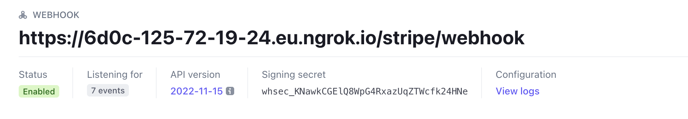

## Diagonal with Stripe integration server example

Example backend integration repo with Stripe using Typescript and a NodeJS Express server.

- [Installation](#installation)
  - [pnpm](#pnpm)
    - [Install pnpm](#install-pnpm)
    - [Install dependencies](#install-dependencies)
  - [npm](#npm)
    - [Install dependencies](#install-dependencies-1)
- [Running the server](#running-the-server)
  - [1. Forward webhook requests to localhost](#1-forward-webhook-requests-to-localhost)
  - [2. Configure Stripe webhook config](#2-configure-stripe-webhook-config)
    - [Dashboard UI](#dashboard-ui)
    - [API](#api)
  - [3. Configure Diagonal webhook config](#3-configure-diagonal-webhook-config)
  - [4. Environment variables](#4-environment-variables)
  - [5. Start](#5-start)
- [Endpoints](#endpoints)
  - [Checkout](#checkout)
    - [`POST /diagonal/checkout`:](#post-diagonal-checkout)
      - [Parameters:](#parameters-)
    - [`POST /stripe/checkout`:](#post-stripe-checkout)
      - [Parameters:](#parameters-1)
  - [Payment methods](#payment-methods)
    - [`POST /stripe/add-card`:](#post-stripe-add-card)
    - [`POST /diagonal/add-wallet`:](#post-diagonal-add-wallet)
    - [`POST /set-default-payment-method`:](#post-set-default-payment-method)
      - [Parameters:](#parameters-2)
    - [`GET /list-payment-methods`:](#get-list-payment-methods)
  - [Subscriptions](#subscriptions)
    - [`GET /subscriptions`:](#get-subscriptions)
    - [`POST /cancel-subscription`:](#post-cancel-subscription)
      - [Parameters:](#parameters-3)
    - [`POST /update-subscription`:](#post-update-subscription)
      - [Parameters:](#parameters-4)
  - [Customer](#customer)
    - [`POST /create-customer`:](#post-create-customer)
      - [Parameters:](#parameters-5)
    - [`POST /stripe/webhook`:](#post-stripe-webhook)
    - [`POST /diagonal/webhook`:](#post-diagonal-webhook)

## Installation

### pnpm

#### Install pnpm

```bash
wget -qO- https://get.pnpm.io/install.sh | sh -
```

#### Install dependencies

```bash
pnpm install
```

### npm

#### Install dependencies

```bash
npm install
```

---

## Running the server

### Requirements

- Node v10+

### 1. Forward webhook requests to localhost

We recommend using https://ngrok.com/

1. Register for an account
2. Go to https://dashboard.ngrok.com/get-started/setup for simple guide

Once having the forwarding, you can register webhook config in Stripe and Diagonal based on the ngrok.com endpoint

### 2. Configure Stripe webhook config

You can either do it through the Dashboard UI or via the API:

#### Dashboard UI

1. Access https://dashboard.stripe.com/test/webhooks/create in Stripe's Dashboard, and select the following events:

- `invoice.payment_succeeded`
- `invoice.payment_failed`
- `customer.subscription.deleted`
- `customer.subscription.trial_will_end`
- `invoice.created`
- `invoice.finalized`

With URL being: `<ngrok.io endpoint>/stripe/webhook`.

2. Access the Webhook Config page `https://dashboard.stripe.com/test/webhooks/<webhook-endpoint-id>`

And press the `Reveal` under the `Signing secret` section to get the secret. Then use the value to initialize the `STRIPE_WEBHOOK_SECRET` environment variable.



#### API

You can also use the API directly to setup the webhook endpoints:

```bash
curl https://api.stripe.com/v1/webhook_endpoints \
  -u sk_test_51Mg4G8KtjYJMPxxdd....: \
  -d url="https://6d0c-125-72-19-24.eu.ngrok.io/stripe/webhook" \
  -d "enabled_events[]"="invoice.payment_succeeded" \
  -d "enabled_events[]"="invoice.payment_failed" \
  -d "enabled_events[]"="customer.subscription.deleted" \
  -d "enabled_events[]"="customer.subscription.trial_will_end" \
  -d "enabled_events[]"="invoice.created" \
  -d "enabled_events[]"="invoice.finalized"
```

**Note**: URL is `<ngrok.io endpoint>/stripe/webhook`

This will return the webhook config instance with the signing secret inside the payload:

```json
{
	"id": "we_1Mg82SKtjYJMPxxdblK6kkRJ",
	"object": "webhook_endpoint",
	"api_version": null,
	"application": null,
	"created": 1677509452,
	"description": null,
	"enabled_events": [
		"invoice.payment_succeeded",
		"invoice.payment_failed",
		"customer.subscription.deleted",
		"customer.subscription.trial_will_end",
		"invoice.created",
		"invoice.finalized"
	],
	"livemode": false,
	"metadata": {},
	"secret": "whsec_KNawkCGElQ8WpG4RxazUqZTWcfk24HNe",
	"status": "enabled",
	"url": "https://6d0c-125-72-19-24.eu.ngrok.io/stripe/webhook"
}
```

Use the `secret` value to initialize the `STRIPE_WEBHOOK_SECRET` environment variable.

### 3. Configure Diagonal webhook config

For now, only the API is available for configuring the webhook config at Diagonal.

```bash
curl https://api.test.diagonal.finance/v1/webhook/configs \
  -H 'X-API-Key: secret_test_UJxZOTVdP0qHdP0qHrmw2yAJIIi5Y6dgrD' \
  -d url="https://6d0c-125-72-19-24.eu.ngrok.io/diagonal/webhook" \
  -d "events[]"="checkout_session.complete_request" \
  -d "events[]"="charge.attempt_failed" \
  -d "events[]"="charge.failed" \
  -d "events[]"="charge.confirmed" \
  -d "events[]"="signature.charge.request"
```

**Note**: URL is `<ngrok.io endpoint>/diagonal/webhook`

```json
{
	"id": "wconfig_pAhxk9tAWwUcUtg1ceme",
	"object": "webhook_config",
	"created_at": 1677510462,
	"events": [
		"checkout_session.complete_request",
		"charge.attempt_failed",
		"charge.failed",
		"charge.confirmed",
		"signature.charge.request"
	],
	"metadata": null,
	"reference": null,
	"url": "https://6d0c-125-72-19-24.eu.ngrok.io/diagonal/webhook",
	"secret": "wsecret_test_JMZOTVdP0qHdP0qHrm30b2C3eTBijT"
}
```

Use the `secret` value to initialize the `DIAGONAL_WEBHOOK_SECRET` environment variable.

**Note**: `secret` is only shown when creating the configuration, getting the configuration through the API later on will not return the `secret`.

### 4. Environment variables

```
DIAGONAL_WEBHOOK_SECRET=<secret from webhook config created response>
DIAGONAL_API_SECRET=<Diagonal api key secret>
DIAGONAL_SIGNER_PRIVATE_KEY=<signer private key to sign charge attestations>
STRIPE_WEBHOOK_SECRET=<secret from webhook config created response>
STRIPE_API_SECRET=<Stripe api key secret>
```

### 5. Start

```bash
pnpm run start
```

## Endpoints

These are the endpoints exposed through the Express server.

### Checkout

#### `POST /diagonal/checkout`:

Creates a Diagonal checkout and returns the session URL to redirect the client to.

##### Parameters:

```json
{
	"priceId": "price_1Mg73kKtjYJMPxxdDsL442d6"
}
```

- `priceId`: Stripe price id to fetch amount and recurring details for creating a Diagonal Checkout Session.

#### `POST /stripe/checkout`:

Creates a Stripe checkout and returns the session URL to redirect the client to.

##### Parameters:

```json
{
	"priceId": "price_1Mg73kKtjYJMPxxdDsL442d6"
}
```

- `priceId`: Stripe price id to create a Checkout Session.

### Payment methods

#### `POST /stripe/add-card`:

Adds a card using a Stripe Checkout Session with mode setup. Returns the session URL to redirect the client to.

#### `POST /diagonal/add-wallet`:

Adds a new wallet using a Diagonal Setup Session. Returns the session URL to redirect the client to.

#### `POST /set-default-payment-method`:

Defines what's the preferred payment method for a specific user - either card or wallet. It will also update subscriptions to use the payment method for future invoices.

##### Parameters:

```json
{
	"isWallet": true,
	"paymentMethodId": "pm_9TrzOea4d8yRgIBQ"
}
```

- `isWallet`: Whether the selected payment method is a Wallet (Diagonal) or Card (Stripe).
- `paymentMethodId`: Either Stripe or Diagonal selected payment method.

#### `GET /list-payment-methods`:

Lists the customer payment methods, either cards or wallets.

### Subscriptions

#### `GET /subscriptions`:

Lists all subscriptions for the given user.

#### `POST /cancel-subscription`:

Cancels a given subscription through Stripe.

##### Parameters:

```json
{
	"subscriptionId": "sub_1Mg77PKtjYJMPxxd2PX85fUo"
}
```

#### `POST /update-subscription`:

Updates a subscription through Stripe to provided price id.

##### Parameters:

```json
{
	"priceId": "price_1Mg73kKtjYJMPxxdDsL442d6",
	"subscriptionId": "sub_1Mg77PKtjYJMPxxd2PX85fUo"
}
```

### Customer

#### `POST /create-customer`:

Creates a new customer in the fictional database and Stripe, as well as setting the auth cookie.

##### Parameters:

```json
{
	"email": "johndoe@example.com"
}
```

#### `POST /stripe/webhook`:

Handles Stripe webhooks events.

#### `POST /diagonal/webhook`:

Handles Diagonal webhooks events.

---

## Notify

When handling webhook events such as `charge.attempt_failed` or `charge.confirmed`, Diagonal recommends you notify your customer about the status of their subscription.

For example, when a charge attempt has failed, in order to reduce churn you may want to notify your customers about the failed charge, why it failed (`charge.last_attempt_failure_reason`), when it will be rescheduled (`charge.next_attempt_at`).

We provide a series of simple [email templates](https://docs.diagonal.finance/docs/dunning-flows) for your convenience that demonstrate how you can use Diagonal webhook events to extract relevant information and notify your customers accordingly.

If you are looking for a way to send automated emails, here are some popular options:

- [Twilio SendGrid](https://www.twilio.com/en-us/sendgrid/email-api)
- [Mailchimp](https://mailchimp.com/en-gb/features/transactional-email/?currency=EUR)
- [AWS SES](https://docs.aws.amazon.com/ses/latest/dg/send-email.html)
- [Mailgun](https://www.mailgun.com/)
- [Postmark](https://postmarkapp.com/)
- [Customer IO](https://customer.io/)

---